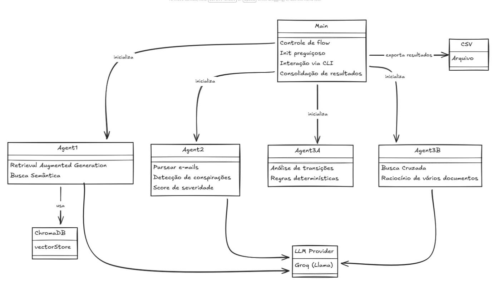

# 🏢 Sistema de Auditoria: THE SCARN!
## (T)emporal (H)ybrid (E)ngine for (S)emantic (C)ompliance & (A)nomaly (R)ecognition (N)etwork

Sistema multi-agente de auditoria de compliance desenvolvido para Toby Flenderson (RH) da Dunder Mifflin Scranton.

> ["There's a whole crowd of people out there who need to learn how to do THE SCARN."](https://drive.google.com/file/d/1TDClX0GoSrT7t1lui5P5QFhCBXdbQudV/view?usp=sharing)

---

## 📋 Visão Geral

Este sistema utiliza **4 agentes especializados** baseados em LLM (Claude Sonnet 4) para:

1. **Responder dúvidas sobre compliance** (RAG)
2. **Detectar conspiração contra Toby** (análise de emails)
3. **Identificar fraudes standalone** (análise de transações)
4. **Detectar fraudes contextuais** (cruzamento emails + transações)

--- 


## 🚀 Como Rodar

### Pré-requisitos

- Python 3.9+

### Instalação

1. **Clone o repositório**
```bash
git clone the-office-chatbot
cd the-office-chatbot
```

2. **Crie ambiente virtual**
```bash
python -m venv venv
source venv/bin/activate  # Linux/Mac
# ou
venv\Scripts\activate  # Windows
```

3. **Instale dependências**
```bash
pip install -r requirements.txt
```

4. **Configure variáveis de ambiente**
```bash
cp .env.example .env
# Edite .env e adicione sua GROQ_API_KEY
```

5. **Prepare os dados**
```bash
# Copie os arquivos para a pasta data/
mkdir -p data
cp politica_compliance.txt data/
cp transacoes_bancarias.csv data/
cp emails.txt data/
```

### Execução

```bash
python main.py
```

---

## 🏗️ Arquitetura do Sistema

### Diagrama de Agentes


### Fluxo de Dados Detalhado

#### 1️⃣ Agente de Compliance RAG

```
┌─────────────────────────────────────────────────────────────────┐
│                   INICIALIZAÇÃO (lazy load)                     │
└─────────────────────────────────────────────────────────────────┘
                            │
                            ▼
┌─────────────────────────────────────────────────────────────────┐
│  1. Carregar politica_compliance.txt                            │
│  2. Dividir em chunks (800 chars, overlap 150)                  │
│  3. Criar ChromaDB collection                                   │
│  4. Adicionar chunks com embeddings                             │
└─────────────────────────────────────────────────────────────────┘
                            │
                            ▼
┌─────────────────────────────────────────────────────────────────┐
│                      QUERY (runtime)                            │
└─────────────────────────────────────────────────────────────────┘
                            │
                            ▼
    ┌───────────────────────────────────────────┐
    │ User Question: "Qual é o limite?"         │
    └───────────────────────────────────────────┘
                            │
                            ▼
    ┌───────────────────────────────────────────┐
    │ ChromaDB.query(question, n_results=4)     │
    │ → Similarity search                       │
    └───────────────────────────────────────────┘
                            │
                            ▼
    ┌───────────────────────────────────────────┐
    │ Retrieve top-4 relevant chunks            │
    │ Chunk 1: "SEÇÃO 1: ALÇADAS..."            │
    │ Chunk 2: "1.1. DESPESAS MENORES..."       │
    │ Chunk 3: ...                              │
    │ Chunk 4: ...                              │
    └───────────────────────────────────────────┘
                            │
                            ▼
    ┌───────────────────────────────────────────┐
    │ Construir prompt para Claude:             │
    │                                           │
    │ SYSTEM: "Você é assistente de compliance" │
    │ USER: "CONTEXTO: [chunks]                 │
    │        PERGUNTA: [question]"              │
    └───────────────────────────────────────────┘
                            │
                            ▼
    ┌───────────────────────────────────────────┐
    │ Groq                                      │
    │ - Lê contexto                             │
    │ - Responde baseado apenas no contexto     │
    │ - Cita seções relevantes                  │
    └───────────────────────────────────────────┘
                            │
                            ▼
    ┌───────────────────────────────────────────┐
    │ RESPOSTA:                                 │
    │ "De acordo com a Seção 1.1, você pode...  │
    │  gastar até $50 sem aprovação..."         │
    └───────────────────────────────────────────┘
```

---

#### 2️⃣ Agente de Detecção de Conspiração

```
┌─────────────────────────────────────────────────────────────────┐
│                    ANÁLISE DE EMAILS                            │
└─────────────────────────────────────────────────────────────────┘
                            │
                            ▼
    ┌───────────────────────────────────────────┐
    │ 1. Carregar emails.txt                    │
    │ 2. Parsear em estruturas                  │
    └───────────────────────────────────────────┘
                            │
                            ▼
    ┌───────────────────────────────────────────┐
    │ FILTRAGEM:                                │
    │                                           │
    │ Para cada email:                          │
    │   if (de/para Michael) OR                 │
    │      (menciona "Toby"):                   │
    │     → adicionar a relevant_emails         │
    └───────────────────────────────────────────┘
                            │
                            ▼
    ┌───────────────────────────────────────────┐
    │ Para cada email relevante:                │
    │                                           │
    │   1. Formatar email                       │
    │   2. Enviar para Claude com prompt:       │
    │      "Detecte padrões de conspiração"     │
    │   3. Receber análise JSON:                │
    │      {                                    │
    │        is_suspicious: bool,               │
    │        severity: 0-10,                    │
    │        reasoning: str,                    │
    │        evidence_quotes: [str]             │
    │      }                                    │
    └───────────────────────────────────────────┘
                            │
                            ▼
    ┌───────────────────────────────────────────┐
    │ CONSOLIDAÇÃO:                             │
    │                                           │
    │ - Ordenar por severidade                  │
    │ - Agrupar evidências                      │
    │ - Gerar relatório final                   │
    └───────────────────────────────────────────┘
                            │
                            ▼
    ┌───────────────────────────────────────────┐
    │ RELATÓRIO:                                │
    │ • Total emails: 1139                      │
    │ • Suspeitos: X                            │
    │ • Alta severidade: Y                      │
    │ • Conclusão: [Conspiração detectada/não]  │
    └───────────────────────────────────────────┘
```

---

#### 3️⃣ Agente de Fraude Standalone

```
┌─────────────────────────────────────────────────────────────────┐
│               ANÁLISE DE TRANSAÇÕES                             │
└─────────────────────────────────────────────────────────────────┘
                            │
                            ▼
    ┌───────────────────────────────────────────┐
    │ 1. Carregar transacoes_bancarias.csv      │
    │ 2. Parsear com Pandas                     │
    └───────────────────────────────────────────┘
                            │
                            ▼
┌─────────────────────────────────────────────────────────────────┐
│                  VERIFICAÇÃO 1: ITENS PROIBIDOS                 │
├─────────────────────────────────────────────────────────────────┤
│ Para cada transação:                                            │
│   if descrição contém keyword proibida:                         │
│     (binóculo, vigilância, karaokê, arma, etc)                  │
│     → VIOLAÇÃO: Item Proibido (Seção 3)                         │
│                                                                 │
│ Keywords: ['mágica', 'karaokê', 'arma', 'binóculo',             │
│            'vigilância', 'walkie talkie', ...]                  │
└─────────────────────────────────────────────────────────────────┘
                            │
                            ▼
┌─────────────────────────────────────────────────────────────────┐
│           VERIFICAÇÃO 2: VALORES NÃO AUTORIZADOS                │
├─────────────────────────────────────────────────────────────────┤
│ Para cada transação:                                            │
│   if valor > $500:                                              │
│     if "PO" not in descrição:                                   │
│       → VIOLAÇÃO: Sem Purchase Order (Seção 1.3)                │
└─────────────────────────────────────────────────────────────────┘
                            │
                            ▼
┌─────────────────────────────────────────────────────────────────┐
│              VERIFICAÇÃO 3: SMURFING                            │
├─────────────────────────────────────────────────────────────────┤
│ Agrupar por (funcionário, data)                                 │
│                                                                 │
│ Para cada par de transações no mesmo dia:                       │
│   1. Calcular similaridade de descrição (Jaccard)               │
│   2. if similaridade > 60%:                                     │
│        if ambas em [$300, $500]:                                │
│          if soma > $500:                                        │
│            → VIOLAÇÃO: Smurfing (Seção 1.3)                     │
│                                                                 │
│ Exemplo:                                                        │
│   TX_1234: $450 "Papelaria Local"                               │
│   TX_1235: $420 "Papelaria Local"                               │
│   Soma: $870 → SMURFING!                                        │
└─────────────────────────────────────────────────────────────────┘
                            │
                            ▼
┌─────────────────────────────────────────────────────────────────┐
│           VERIFICAÇÃO 4: LOCAIS RESTRITOS                       │
├─────────────────────────────────────────────────────────────────┤
│ Para cada transação:                                            │
│   if "Hooters" in descrição:                                    │
│     → VIOLAÇÃO: Local Restrito (Seção 2.1)                      │
└─────────────────────────────────────────────────────────────────┘
                            │
                            ▼
┌─────────────────────────────────────────────────────────────────┐
│         VERIFICAÇÃO 5: CATEGORIAS SUSPEITAS                     │
├─────────────────────────────────────────────────────────────────┤
│ Para cada transação:                                            │
│   if categoria == "Segurança":                                  │
│     → VIOLAÇÃO: Possível Armamento (Seção 3.2)                  │
└─────────────────────────────────────────────────────────────────┘
                            │
                            ▼
    ┌───────────────────────────────────────────┐
    │ CONSOLIDAÇÃO:                             │
    │ - Remover duplicatas                      │
    │ - Ordenar por severidade                  │
    │ - Gerar relatório                         │
    │ - Exportar CSV                            │
    └───────────────────────────────────────────┘
```

---

#### 4️⃣ Agente de Fraude Contextual

```
┌─────────────────────────────────────────────────────────────────┐
│          ANÁLISE CRUZADA: EMAILS ↔ TRANSAÇÕES                   │
└─────────────────────────────────────────────────────────────────┘
                            │
                            ▼
    ┌───────────────────────────────────────────┐
    │ 1. Carregar emails.txt                    │
    │ 2. Carregar transacoes_bancarias.csv      │
    └───────────────────────────────────────────┘
                            │
                            ▼
┌─────────────────────────────────────────────────────────────────┐
│               ESTRATÉGIA 1: COORDENAÇÃO FRAUDULENTA             │
├─────────────────────────────────────────────────────────────────┤
│ 1. Filtrar emails com keywords suspeitas:                       │
│    ['dividir', 'combinar', 'segredo', 'não contar']             │
│                                                                 │
│ 2. Para cada email suspeito:                                    │
│    a. Extrair participantes (de/para)                           │
│    b. Buscar transações dos participantes                       │
│    c. Filtrar por data próxima ao email                         │
│                                                                 │
│ 3. Enviar para Claude:                                          │
│    PROMPT: "Analise se este email e estas transações            │
│             indicam coordenação fraudulenta"                    │
│                                                                 │
│ 4. Se Claude retornar is_fraud=true:                            │
│    → VIOLAÇÃO: Coordenação Fraudulenta                          │
└─────────────────────────────────────────────────────────────────┘
                            │
                            ▼
┌────────────────────────────────────────────────────────────────┐
│            ESTRATÉGIA 2: CONFLITO DE INTERESSE                 │
├────────────────────────────────────────────────────────────────┤
│ 1. Filtrar emails sobre negócios paralelos:                    │
│    ['startup', 'vela', 'beterraba', 'wuphf']                   │
│                                                                │
│ 2. Buscar transações do remetente                              │
│                                                                │
│ 3. Analisar com Claude se há uso de verba corporativa          │
│    para negócio pessoal (Cláusula Ryan/Jan)                    │
└────────────────────────────────────────────────────────────────┘
                            │
                            ▼
┌────────────────────────────────────────────────────────────────┐
│           ESTRATÉGIA 3: JUSTIFICATIVAS FALSAS                  │
├────────────────────────────────────────────────────────────────┤
│ 1. Emails que mencionam despesas/compras                       │
│ 2. Extrair valores mencionados                                 │
│ 3. Buscar transações correspondentes                           │
│ 4. Verificar se justificativa no email contradiz transação     │
└────────────────────────────────────────────────────────────────┘
                            │
                            ▼
┌───────────────────────────────────────────────────────────────┐
│              ESTRATÉGIA 4: USO PESSOAL                        │
├───────────────────────────────────────────────────────────────┤
│ 1. Emails sobre uso pessoal:                                  │
│    ['aniversário', 'família', 'presente']                     │
│ 2. Buscar transações relacionadas                             │
│ 3. Verificar se gasto pessoal foi reembolsado                 │
└───────────────────────────────────────────────────────────────┘
                            │
                            ▼
    ┌───────────────────────────────────────────┐
    │ CONSOLIDAÇÃO:                             │
    │ - Agrupar evidências                      │
    │ - Gerar relatório com contexto            │
    │ - Citar email + transação                 │
    └───────────────────────────────────────────┘
```

---

### Decisões de Design

#### Por que Multi-Agente?

1. **Separação de Responsabilidades**
   - Cada agente tem expertise em um domínio específico
   - Facilita manutenção e testes
   - Permite evolução independente

2. **Prompts Especializados**
   - Cada agente tem um prompt otimizado para sua tarefa
   - Melhora qualidade das respostas
   - Reduz ambiguidade

3. **Lazy Loading**
   - Agentes só são inicializados quando necessários
   - Economiza recursos
   - Startup mais rápido

#### Por que ChromaDB?

1. **Persistência** - Não precisa reindexar a cada run
2. **Simplicidade** - API limpa e fácil
3. **Embeddings automáticos** - Função padrão funciona bem
4. **Zero configuração** - Funciona out-of-the-box

---

#### 🔄 Orquestrador (`main.py`)

**Responsabilidades:**
- Interface CLI amigável
- Lazy loading de agentes (eficiência)
- Coordenação de fluxos de auditoria
- Geração de relatórios executivos
- Exportação de dados

**Menu Interativo:**
```
[1] Chatbot de Compliance
[2] Detector de Conspiração  
[3] Detector de Fraudes
[4] Auditoria Completa
[0] Sair
```

---


## 📊 Testes e Demonstração

### Teste 1: Chatbot de Compliance

**Objetivo:** Verificar se o RAG responde corretamente sobre regras

**Perguntas de Teste:**
```
✓ Qual é o limite de gastos sem aprovação?
✓ Posso comprar equipamento de karaokê?
✓ Posso jantar no Hooters com cliente?
```

**Critério de Sucesso:**
- ✅ Respostas baseadas apenas na política
- ✅ Citação de seções relevantes
- ✅ Valores monetários corretos
- ✅ Sem alucinações

---

### Teste 2: Detecção de Conspiração

**Objetivo:** Identificar se Michael conspira contra Toby

**Processo:**
1. Analisa todos os emails
2. Filtra emails relevantes (de/para Michael ou menciona Toby)
3. Classifica por severidade
4. Gera relatório

**Critério de Sucesso:**
- ✅ Identifica emails hostis
- ✅ Classifica severidade corretamente
- ✅ Fornece evidências (citações)
- ✅ Gera relatório consolidado

---

### Teste 3A: Fraudes Standalone

**Objetivo:** Detectar violações diretas de compliance

**Verificações:**
- ✅ Itens proibidos (binóculos, walkie-talkies, etc.)
- ✅ Valores acima de alçada (>$500 sem PO)
- ✅ Smurfing (divisão artificial)
- ✅ Locais restritos (Hooters)

**Saída:**
- Relatório textual
- CSV exportável com detalhes

---

### Teste 3B: Fraudes Contextuais

**Objetivo:** Detectar fraudes via cruzamento emails ↔ transações

**Casos a Detectar:**
- ✅ Coordenação entre funcionários
- ✅ Conflitos de interesse
- ✅ Justificativas falsas
- ✅ Uso pessoal de verba

**Critério de Sucesso:**
- ✅ Identifica esquemas coordenados
- ✅ Cruza dados corretamente
- ✅ Justifica com evidências de ambas as fontes

---

## 📁 Estrutura do Projeto

```
dunder_mifflin_audit/
│
├── agents/
│   ├── compliance_rag_agent.py      # Agente 1: RAG Chatbot
│   ├── conspiracy_agent.py          # Agente 2: Detector Conspiração
│   ├── standalone_fraud_agent.py    # Agente 3A: Fraude Standalone
│   └── contextual_fraud_agent.py    # Agente 3B: Fraude Contextual
│
├── utils/
│   ├── document_loader.py           # Utilitários de carga 
│   └── llm_adapter.py               # Adapter para incluir mais providers
│
├── data/
│   ├── politica_compliance.txt      # Política de compliance
│   ├── transacoes_bancarias.csv     # Transações
│   └── emails.txt                   # Dump de emails
│
├── chroma_db/                       # Vector store (criado automaticamente)
│
├── main.py                          # Orquestrador principal
├── config.py                        # Configurações
├── requirements.txt                 # Dependências
├── .env.example                     # Template de variáveis de ambiente
├── .gitignore                       # Arquivos ignorados
└── README.md                        # Este arquivo
```

---


## 🆘 Troubleshooting

### Erro: "GROQ_API_KEY not found"
```bash
# Certifique-se de ter o .env configurado
cp .env.example .env
# Edite .env e adicione sua chave
```

### Erro: ChromaDB não inicializa
```bash
# Delete a pasta e deixe recriar
rm -rf chroma_db/
```

### Erro: Arquivo não encontrado
```bash
# Verifique se os arquivos estão em data/
ls data/
# Devem estar: emails.txt, politica_compliance.txt, transacoes_bancarias.csv
```

---
